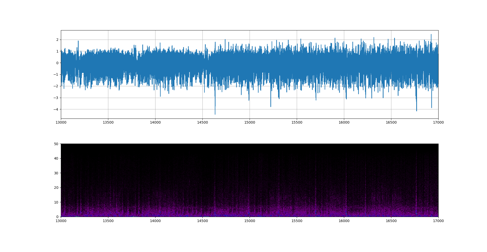
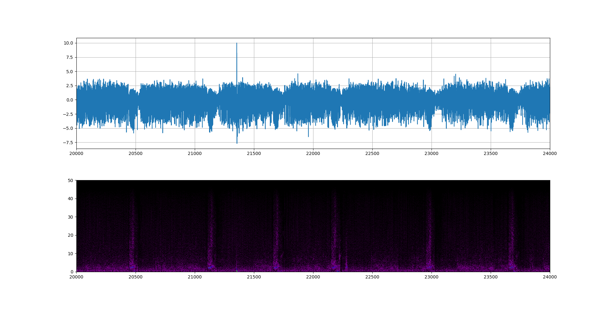

# WAG/Rij-rat spectrogram

## Description

This is example of real data analysis - [WAG/Rij-rat](https://nl.wikipedia.org/wiki/WAG/Rij-rat) [spectrogram.](https://en.wikipedia.org/wiki/Spectrogram)
WAG/Rij-rat is a genetic animal model of [absence epilepsy](https://en.wikipedia.org/wiki/Absence_seizure) from [Radboud University](https://www.researchgate.net/institution/Radboud_University/department/Donders_Institute_for_Brain_Cognition_and_Behaviour) in Netherlands. 

## Repository

This repository has:

- [data of brain activity WAG/Rij-rat](https://yadi.sk/d/REVgBJ_N3R7jjZ)
- [time list of absence seizures for this rat](https://github.com/rcv911/rat-spectrogram/tree/master/doc)

## Motivation

[Epileptic seizures](https://en.wikipedia.org/wiki/Epileptic_seizure) is a result of wrong electrical activity in the brain. There are many different types of epileptic seizures and seizure triggers.
It's a big part of medical diagnosing.

>In fact, there is no obvious sign a person has epilepsy, unless they are having a seizure, it can make diagnosing epilepsy difficult. A diagnosis is usually made after a person has had more than one epileptic seizure.

So, there is big interest of how to find, to stop epilepsy attack but more important finds the reasons of seizures. 
Neuroscience do this.

## Results

It's pure spectrogram

This is spectrogram with epileptic seizures. look at the spikes.

## Installation

You can use [Python](https://www.python.org/) with data package: [Anaconda](https://www.anaconda.com/) or [Miniconda](https://conda.io/miniconda).
There's another way - use [Portable Python](http://portablepython.com/). Also you can use whatever IDE for Python.

## License

Free